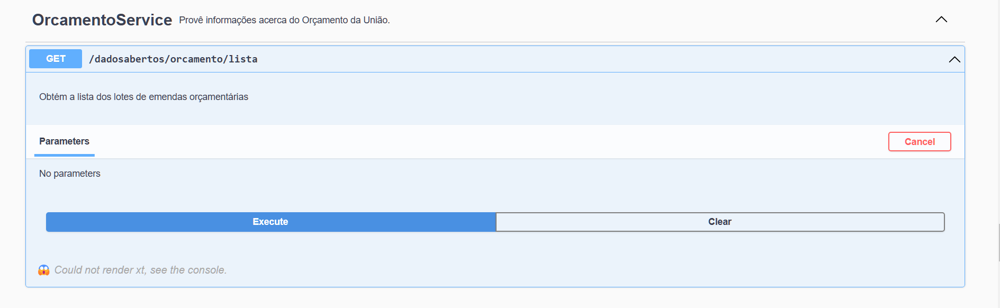

# Aleon Senado Federal Analytics

## O que foi usado para desenvolver as análises

1. Versão Python:

   - 3.10

2. Versionamento:

   - Git

3. Bibliotecas:

   - requests: para realizar chamadas a api do senado
   - pandas: processamento das tabelas
   - xmltodict: fazer o `parser` dos resultados advindos da api
   - matplotlib: exibir os gráficos
   - networkx: construir grafos e exibi-los
   - numpy: manipulação extra de alguns dados vetoriais

   para instalar as dependências:

   ```bash
   pip install -r requirements.txt
   ```

4. Análises

**Histogramas que mostram a porcentagem de matérias legislativas feitas pelos congressistas:**

- Pode-se analisar a baixa adesão dos congressistas (senadores e deputados) com relação ao trabalho de autoria e relatoria de matérias legislativas no congresso.
  

**Histograma que mostra o número de senadores por cada partido**

- Pode-se analisar que o partido que possui maior influência no senado é o PSD.
  

**Histograma que mostra a quantidade de matérias legislativas por partido**

- Pode-se analisar que os partidos que mais participam dessa atividade são PL, PT e PSD.
  

**Histograma que mostra o número de assuntos específicos para cada assunto geral discutido no congresso**

- Pode-se analisar que o assunto com mais desdobramentos é o econômico.
  

**Grafo de proximidade que mostra os partidos mais relacionados com base em blocos políticos no congresso**

- Pode-se analisar nesse grafo a proximidade dos partidos de esquerda e direita como dois grafos separados, em que os vértices representam o bloco que os partidos se ligam e os nós a sigla do partido.
  

**Histograma com a participação dos partidos nas votações de matérias legislativas em 2024**

- Pode-se analisar que todos os partidos tem uma participação relevante nas votações, acima de 90%, sendo os partidos NOVO, PSB, PSDB e REPUBLICANOS os que acumulam 100% de participação.
  

5. Problemas de análise não resolvidos:

- Poderia-se ter feito uma análise do tipo de assunto geral e específico que cada partido mais legisla, fazendo a ligação com a proximidade dos partidos mas a api não retorna na lista de matérias em tramitação o código de assunto geral, deveria ser feito requests separadas, podendo levar a rate limit exceeded.

- Poderia-se também realizar consultas a api dos deputados, fazendo alguma correlação dos senadores e deputados de cada partido.

- Poderia-se também realizar a ligação dos gastos de cada senador e seus partidos, mas a api não retorna esses valores, aparece o erro ` Maximum call stack size exceeded`
  
